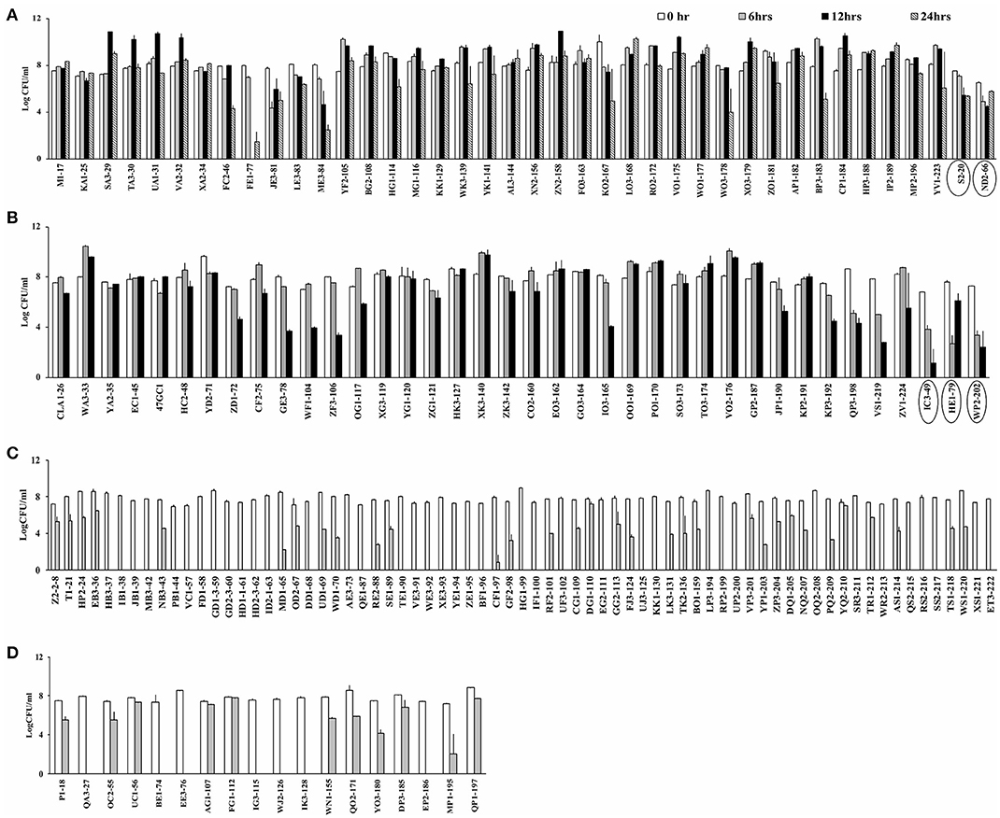
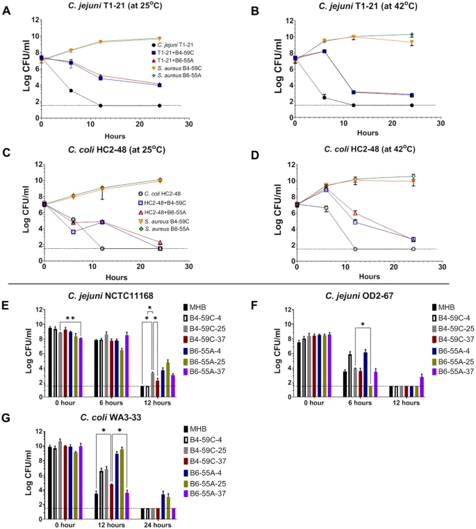

---
**Current Position: Postdoctoral Research Associate**  
Department of Biological Science  
University of Tulsa, Tulsa, OK  

### Education

  - **Ph.D.**(2021) *Biological Science (Molecular Microbiology)*, **University of Tulsa**, Tulsa, OK  
  - **M.Sc.**(2009) *Medical Microbiology*, **Tribhuvan University**, Kathmandu, Nepal  
  - **B.Sc.**(2006) *Microbiology*, **Tribhuvan University**, Kathmandu, Nepal  

### Research Interest
[Google Scholar](https://scholar.google.com/citations?user=g5NJJPIAAAAJ&hl=en)  

  1. **Molecular characterization of plasmids from foodborne pathogens**  

  
FIGURE 1. Different types of plasmids identified in our study. Circular Figure represents the pangenome analysis for all plasmid sequences from our laboratory. Individual slot (circle) in the figure represent one plasmid sequence. Pangenome analysis for all plasmid sequences was completed with GView server.  

  2. **Stress response mechanism of foodborne pathogens**  

  
FIGURE 2. Screening for aerotolerant *Campylobacter* strains by incubating in MHB aerobically with agitation. (A) Hyper-aerotolerant *C. coli* and *C. jejuni* (circled) strains surviving a 24 h exposure to aerobic growth conditions. (B) Aerotolerant *C. coli* and *C. jejuni* (circled) strains surviving a 12 h exposure to aerobic conditions. Aerosensitive (C) *C. jejuni* and (D) *C. coli* strains not surviving the 12 h exposure to aerobic conditions. Error bars represent the mean standard error of triplicate experiments.  

  3. **Molecular detection of foodborne pathogens**  
  
  4. **Influence of polymicrobial condition on stress response and pathogenicity**  
  
  

FIGURE 3. Aerotolerance of *Campylobacter* in mono or mixed cultures containing *S. aureus* strains or cell-free extracts. (A–D), Survival of *C. jejuni* T1-21 and *C. coli* HC2-48 in mono and mixed cultures of *S. aureus* B4-59C and B6-55A incubated at 25 °C and 42 °C with aerobic conditions. (E) Survival of *C. jejuni* NCTC11168, (F) *C. jejuni* OD2-67, and (G) *C. coli* WA3-33 in media containing cell-free extracts of *S. aureus* at 42 °C with aerobic conditions. The *S. aureus* cell-free extracts listed in the Fig. 1 legend were used in this experiment. *Campylobacter* cells grown in non-amended MHB served as a control. Mean values of CFU counts with SD error bars are represented in figures. Horizontal dotted lines in the figures represent the limit of detection for colony counts (LOD, ~ 33 CFU/ml) in these assays. All data points plotted on the LOD line in figure (A–D) and all the bars not exceeding LOD line in figures (E–G) represent the readings for the respective time points with no detectable CFU counts. Two-way ANOVA with repeated measures (Tukey multiple comparison tests) was conducted in GraphPad Prism 9: * *p* < 0.05, ** *p* < 0.01, *** *p* < 0.001, **** *p* < 0.0001.

### Assignments

Table 1. List of Assignments.  

| Date | Descriptive Name | Assignment Link
| :-- | :-- | :--
|September 1, 2022 | Preparation of Gihub repository and Rmarkdown | [Assignment_1](Assignments/Assignment1.html)  
|September 9, 2022 | Rmarkdown, Themes | [Assignment_2](Assignments/Assignment2.html)
|September 20, 2022 | Regular Expression | [Assignment_3](Assignments/Assignment_3.html) 
